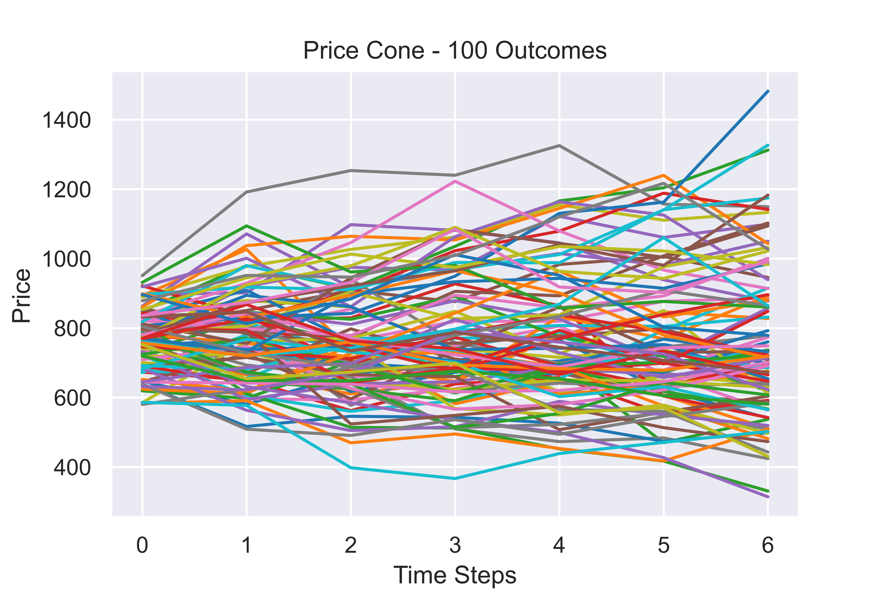
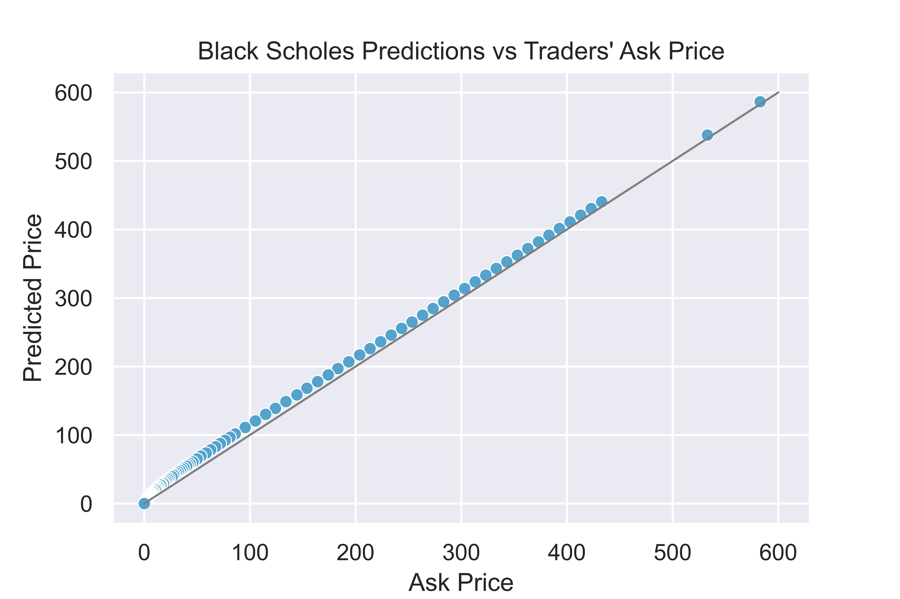
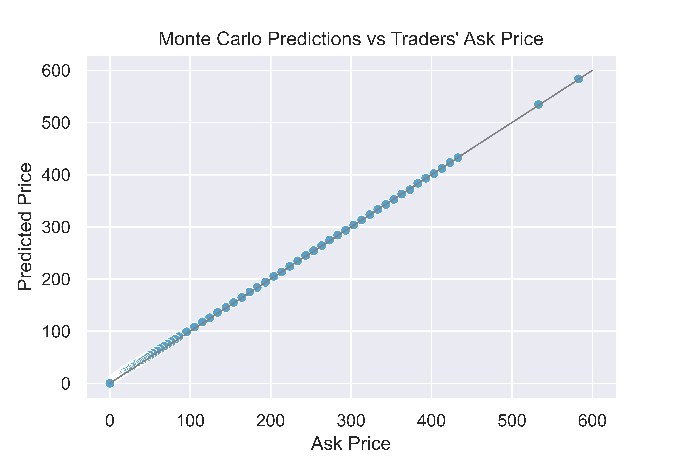
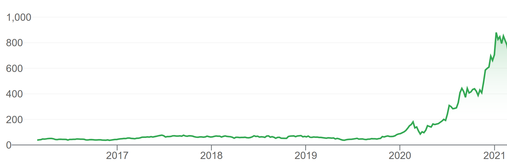

# Option Pricing
This is my attempt at pricing options using the [Black Scholes Model](https://en.wikipedia.org/wiki/Black%E2%80%93Scholes_model) and [Monte Carlo methods](https://en.wikipedia.org/wiki/Monte_Carlo_method#Finance_and_business). The details of how I implemented these methods can be found in the notebook :)

## Brief Overview
**Black Scholes method**: Using the solution to the Black Scholes PDE, I created functions to calculate prices for calls, puts, as well as the option greek, Vega. Initially, I used Newton's root approximation method to determine implied volatilities. Due to it being computationally intensive, I decided to take the standard deviation of the returns instead.

**Monte Carlo method**: Monte Carlo simulations rely on randomness. For each option, I generated random paths for which the stock prices could take (below are the first 100 of 100,000 outcomes). I calculated the option's intrinsic value for each path, and took the average of the positive values to be the predicted price.

More info:
[Random Walk & Geometric Brownian Motion](https://www.investopedia.com/articles/07/montecarlo.asp)

## The Results
Using the ask price as a benchmark, the predictions were accurate overall. As shown in the plots below, the predicted prices are very close to the ask price. 

Black Scholes              |  Monte Carlo
:-------------------------:|:-------------------------:
 | 

Black Scholes was the less accurate method. It tended to overprice options - especially those that were out-of-the-money. The Monte Carlo predictions fit y=x (plotted as a grey line) much more closely.

In both methods, predictions with the highest MSEs came from cheaper options. Genearlly speaking, the cheaper an option, the higher the MSE. This is likely due to the time frame of the input data - both models were fed data from the past year, where the stock grew more rapidly than ever (see 5 year view below). This may very well be the reason my predictions were more optimistic than the traders'.

## Regression Analysis
Upon discovering that in-the-money calls were priced more accurately than out-of-the-money calls, I wanted to find out if any other factors (factors other than the strike price) are correlated with accuracy. Below are the results:

## Final Thoughts & What's to Come
I had a lot of fun implementing these methods on real world data, putting theory into practice, and figuring out how to finetune the models! 

Documenting a few ideas for further exploration:
1. Some of the predictions were overly optimistic because the input data is limited to the past year's prices. Try using a longer time frame. 
2. Quantify trader optimism and measure it against the predictions. There should be a perfect linear relationship between the optimism score and prediction accuracy. Test this hypothesis. 
3. Consider using midquotes instead of transaction data as the benchmark. 
4. Implement the Barone-Adessi & Whaley Model to properly price American options. Also try binomial & trinomial models.
5. Prove the put-call parity with data.
