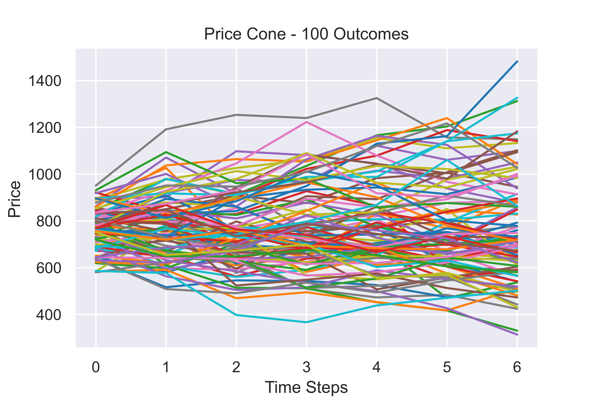
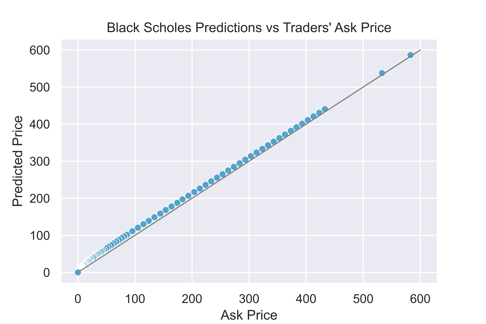
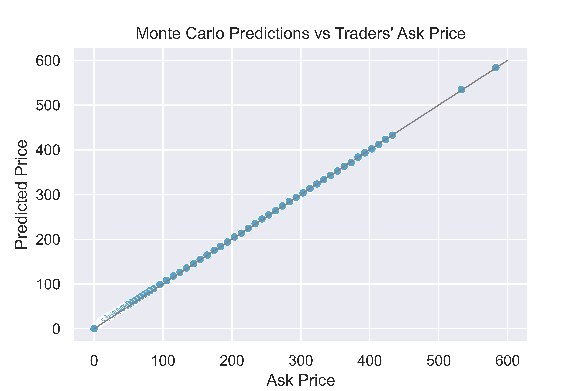

# Option Pricing
This is my attempt at pricing options using the [Black Scholes Model](https://en.wikipedia.org/wiki/Black%E2%80%93Scholes_model) and [Monte Carlo methods](https://en.wikipedia.org/wiki/Monte_Carlo_method#Finance_and_business). The details of how I implemented these methods can be found in the notebook.

## Brief Overview
**Black Scholes method**: Using the solution to the Black Scholes PDE, I created functions to calculate prices for calls, puts, as well as the option greek, Vega. Initially, I used Newton's root approximation method to determine implied volatilities. Due to it being computationally intensive, I decided to take the standard deviation of the returns instead.

**Monte Carlo method**: Monte Carlo simulations rely on randomness. For each option, I generated random paths for which the stock prices could take (below are the first 100 of 100,000 outcomes). I calculated the option's intrinsic value for each path, and took the average of positive intrinsic values to be the predicted price.

More info:
[Random Walk & Geometric Brownian Motion](https://www.investopedia.com/articles/07/montecarlo.asp)

## The Results
Using the ask price as a benchmark, the predictions were accurate overall. As shown in the plots below, the predicted prices are very close to the ask price. 

Black Scholes              |  Monte Carlo
:-------------------------:|:-------------------------:
 | 

Black Scholes was the less accurate method. It tended to overprice options - especially those that were out-of-the-money. The Monte Carlo predictions fit y=x (plotted as a grey line) much more closely.

## Regression Analysis
Upon discovering that in-the-money calls were priced more accurately than out-of-the-money calls, I wanted to find out if any other factors (factors other than the strike price) are correlated with accuracy. Below are the results:

